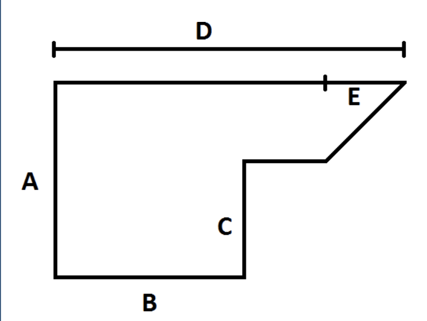

# Instructions  

For this lab, you will find the area of an irregularly shaped room with the shape as shown above.

Ask the user to enter the values for sides A, B, C, D, and E and print out the total room area.

Remember the formula for finding the area of a rectangle is length * width and the area of a right triangle is 0.5 * the base * height.

Please note the final area should be in decimal format.

**Sample Run**

**Console**
```
 _____________________________
 | Enter side A: 11          |
 | Enter side B: 2           |
 | Enter side C: 4           |
 | Enter side D: 7           |
 | Enter side E: 1           |
 |___________________________|
 
**Sample Output**
_____________________________
|  Room Area: 53.5          |
|___________________________|


  